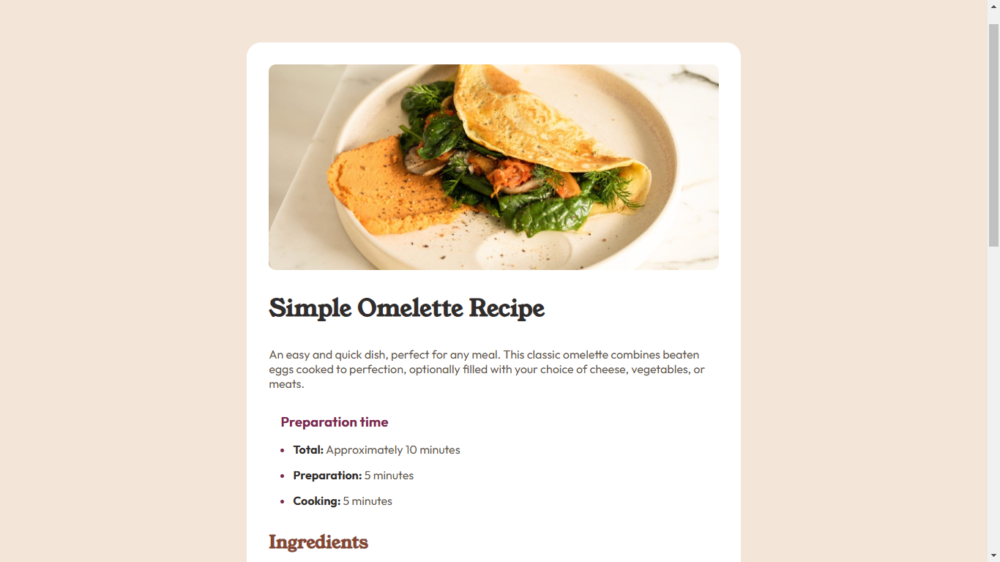

# Frontend Mentor - Recipe page solution

This is a solution to the [Recipe page challenge on Frontend Mentor](https://www.frontendmentor.io/challenges/recipe-page-KiTsR8QQKm).

## Table of contents

- [Overview](#overview)
  - [Screenshot](#screenshot)
  - [Links](#links)
- [My process](#my-process)
  - [Built with](#built-with)
  - [What I learned](#what-i-learned)
  - [Continued development](#continued-development)
- [Author](#author)

## Overview

### Screenshot

### Links

- Solution URL: [https://github.com/webdevsuman/recipe-page](https://github.com/webdevsuman/recipe-page)
- Live Site URL: [https://webdevsuman.github.io/recipe-page/](https://webdevsuman.github.io/recipe-page/)

## My process

1. Structure with semantic HTML
2. Giving a background colour to the body
3. Align the components
4. Giving the elements right size
5. Making the page responsive
6. Giving Elements some colour and border
7. Uploading to Github
8. Making a Readme file and push it to git

### Built with

- Semantic HTML5 markup
- CSS custom properties
- Flexbox
- Media query
- Google fonts

### What I learned

- Negative margin -> Yes, the margin with negative value. Now I know how to use it. Although in theory how it works I still yet to grasp.

### Continued development

This page can become part of a web app. I may not have all the skills required at this moment. But, I have the ideas about developing and including some useful features in this page.

## Author

- Website - [Suman Das](https://github.com/webdevsuman/)
- Frontend Mentor - [@webdevsuman](https://www.frontendmentor.io/profile/webdevsuman)
